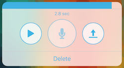

## DCAudioRecord

This is an audio recorder with a custom popup transition written in Objective-C.  Mp3 is the audio format used to encode the audio data.  This code utilizes a framework `lame` and library [JZRecorder](https://github.com/JoeyZeng/JZRecorder) used to encode the mp3 format included.  The UI is very customizable as well.  I've used this in previous apps but no longer maintain this code, so I'm putting the source here for those who wish to use or fork it.

### Preview



### Usage

```objc
- (void)openAudioRecorder
{
    DCAudioRecordViewController *audioRecordView = [[DCAudioRecordViewController alloc] init];
    audioRecordView.themeColor = [UIColor colorWithRed:64.0/255.0 green:180.0/255.0 blue:229.0/255.0 alpha:1.0];
    audioRecordView.buttonFont = [UIFont systemFontOfSize:18.0f];
    audioRecordView.maxAudioSeconds = 3.0f;
    audioRecordView.audioRecordedBlock = ^(NSData *audioData, NSError *error) {
      if (audioData) {
        // Do something with the audio file in NSData format
      }
      audioRecordView = nil;
    };

    [self presentViewController:audioRecordView animated:YES completion:NULL];
}
```

### License

This project is available under the MIT license. See the LICENSE file for more info.
